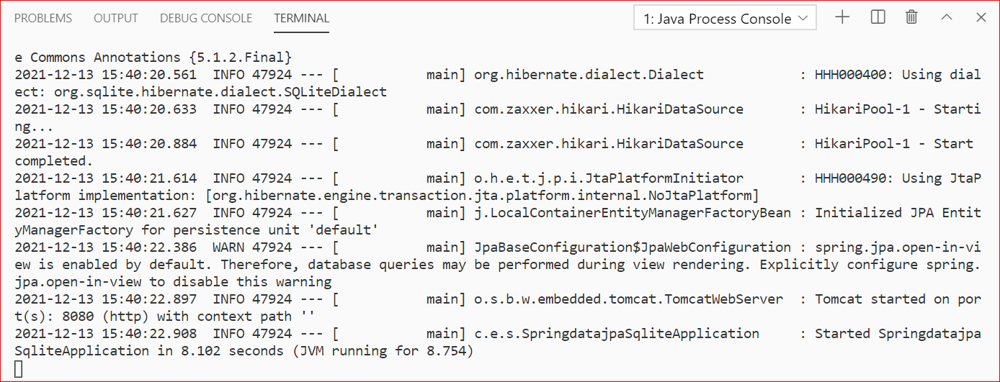
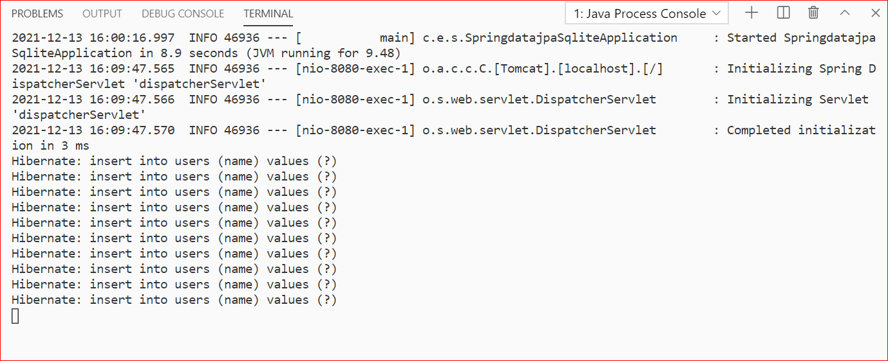
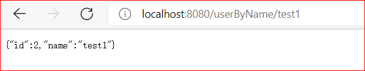
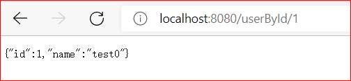
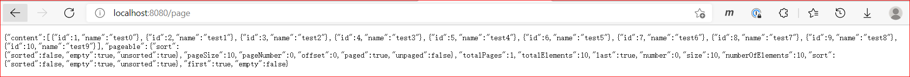
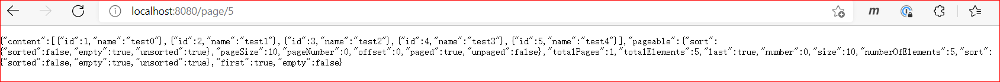
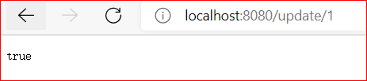
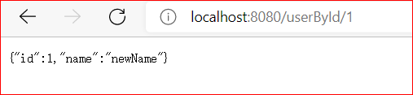
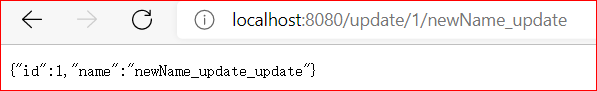

# 测试用接口

## 1 运行

## 2 初始化

`http://localhost:8080/init`

## 3 测试查询

### 3.1 通过 name 查询

`http://localhost:8080/userByName/test1`

### 3.2 通过 id 查询

`http://localhost:8080/userById/1`

## 4 测试分页查询

`http://localhost:8080/page`

## 5 测试条件查询

`http://localhost:8080/page/5`

## 6 测试更新

更新 id=1 的记录，name 设置为 newName

`http://localhost:8080/update/1`

查询 id=1 的记录，可以看到 name 值已经更新

`http://localhost:8080/userById/1`

更新 id=1 且 name=newName 的记录，设置 name 的值为 newName_update

`http://localhost:8080/update/1/newName_update`

